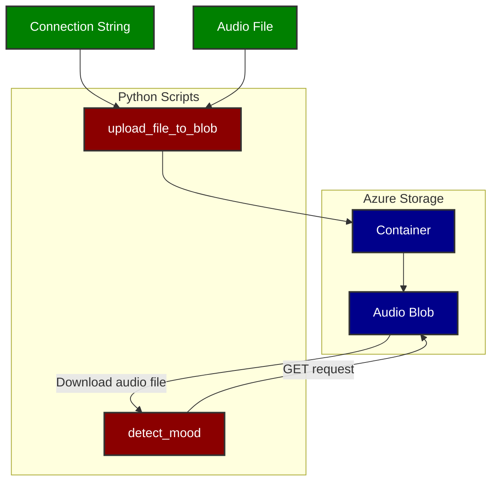

# Wavely Assesment

## Architecture Components
The Mood Detection Service consists of two main components: one for uploading audio files to Azure Blob Storage and another for mood detection based on the time of day. It uses Python scripts and Azure services.

### Azure Blob Storage

Azure Blob Storage is used to store audio files (in the form of blobs).
Create a container within Azure Blob Storage to hold the audio files.

### Python Script for Upload

upload_file_to_blob() is responsible for uploading audio files to Azure Blob Storage.
It uses the Azure SDK for Python to connect to Azure Blob Storage.
### Python Script for Download and Mood Detection

detect_mood() and  download_blob_from_storage() downloads audio files from Azure Blob Storage and detects mood based on the time of day.
It also uses the Azure SDK for Python to connect to Azure Blob Storage.
### Azure Blob Storage Connection String

You can find your Azure Blob Storage connection string in the Azure Portal. This connection string is required for authentication.

## Architecture Diagram


## Installation 
Install Azure Python SDK 
```
pip install azure-storage-blob
```

Login into your azure account by running 

```
az login
```

### Instructions
Find the connection string of the storage account and replace in main.py


Run main.py


## Things to note
For production environment create proper methods with name input parameters to reuse the methods. 

The mood detection algorithm can also run on the cloud instead of running locally. Create APIs to call the python methods and fetch mood. 

Code improvements for cases when a file with selected name already exists. Delete uploaded 'sample.wav' in azure blob before running scrip again. Delete 'downloaded_sample.wav' and then run the script.

Never store credentials in the code like connection string. Save them as secrets. 


